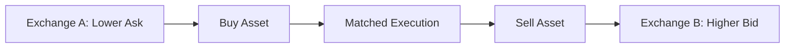

GAIN follows a systematic, market-neutral digital-asset strategy. Rather than relying primarily on whether the market rises or falls, the strategy seeks to capture recurring differences in funding rates and prices across spot and derivatives markets.

The strategy has three principal return sources:

<CardGroup cols={3}>
  <Card title="Funding Rate Capture" icon="arrows-left-right">
    Hedge a spot position with an offsetting perpetual position and seek to collect positive funding payments.
  </Card>

  <Card title="Cross-Exchange Spreads" icon="right-left">
    Buy an asset where its executable price is lower and sell it simultaneously where its executable price is higher.
  </Card>

  <Card title="Funding Rate Spreads" icon="scale-balanced">
    Hold offsetting perpetual positions across exchanges and seek to capture the difference between their funding rates.
  </Card>
</CardGroup>

<Info>
  “Market neutral” describes the strategy’s objective, not a guarantee. Positions may retain temporary directional, basis, execution or counterparty exposure.
</Info>

## 1. Funding Rate Capture

### Why Funding Payments Exist

Perpetual futures do not have a fixed expiry date. Exchanges therefore use periodic funding payments to help keep perpetual prices close to the underlying spot market.

In the common convention:

- when the funding rate is positive, long positions pay short positions;
- when the funding rate is negative, short positions pay long positions.

The actual direction, calculation method and settlement schedule depend on the relevant exchange.

For each settlement interval, the funding payment is determined by the position notional and the applicable funding rate:

$$
\text{Funding Payment}_t = N_t \times f_t
$$

### Spot–Perpetual Hedge

When funding is positive, the strategy may:

1. buy the asset in the spot market; and
2. short an equivalent notional amount of its perpetual contract.

If the spot and perpetual positions are matched, their first-order price exposure largely offsets:

$$
\Delta_{\text{portfolio}}
\approx
\Delta_{\text{spot}}
+
\Delta_{\text{perpetual}}
\approx 0
$$

For example, assume the strategy buys 1 BTC in the spot market and shorts 1 BTC through a perpetual contract:

| Position | Quantity | Directional Delta |
| :-- | --: | --: |
| BTC Spot | Long 1 BTC | Positive 1 |
| BTC Perpetual | Short 1 BTC | Negative 1 |
| **Combined** | Matched positions | **Approximately neutral** |

The objective is therefore not to profit from a rise or fall in BTC, but to receive funding on the short perpetual position while maintaining the hedge.

### Illustrative Calculation

Assume:

| Input | Value |
| :-- | --: |
| Hedged Notional | 1,000,000 USDT |
| Funding Rate | 0.01% per 8 hours |
| Funding Intervals | 3 per day |
| Holding Period | 30 days |

The illustrative gross funding income is:

$$
\begin{aligned}
\text{Gross Funding Income}
&=
1{,}000{,}000
\times 0.01\%
\times 3
\times 30 \\
&=
9{,}000\ \text{USDT}
\end{aligned}
$$

The simple annualized funding rate implied by one interval is:

$$
f_{\text{annualized}}
\approx
f_{\text{interval}}
\times
\text{Intervals per Day}
\times 365
$$

In this example:

$$
0.01\% \times 3 \times 365 = 10.95\%
$$

This figure is only a point-in-time annualization. Funding rates are variable and may decline, reverse or remain unfavorable for extended periods.

### Net Return

Funding received is not the same as strategy profit. A more complete return calculation is:

$$
\begin{aligned}
\Pi_{\text{funding}}
=\;&
\sum_{t=1}^{T} N_t f_t
+ \Delta B \\
&- C_{\text{trading}}
- C_{\text{slippage}}
- C_{\text{borrow}}
- C_{\text{financing}}
\end{aligned}
$$

The terms in this calculation are explained below:

| Term | Meaning |
| :-- | :-- |
| Periodic funding | Funding received or paid during each settlement interval |
| Basis change | Gain or loss from the change in the spot–perpetual basis |
| Trading costs | Exchange and execution fees |
| Slippage costs | Difference between expected and executed prices |
| Borrowing costs | Borrowing cost, where applicable |
| Financing costs | Cost of capital, collateral or stablecoin financing |

<Warning>
  A delta-neutral hedge does not eliminate basis risk. The spot and perpetual prices may move differently, and margin requirements can change before the prices converge.
</Warning>

## 2. Cross-Exchange Spread Capture

The same asset may trade at different prices across exchanges because each venue has distinct liquidity, order flow, inventory and market participants.

If an asset can be purchased at a lower executable ask price on Exchange A and sold at a higher executable bid price on Exchange B, the gross spread per unit is:

$$
s_t
=
P^{\text{bid}}_{B,t}
-
P^{\text{ask}}_{A,t}
$$

The strategy generally seeks to execute both legs at approximately the same time:

### Net Executable Spread

Headline price differences are not sufficient. A trade is considered only when the expected spread remains positive after estimated costs:

$$
\begin{aligned}
\Pi_{\text{cross-exchange}}
=\;&
q
\left(
P^{\text{bid}}_{B}
-
P^{\text{ask}}_{A}
\right) \\
&- F_A - F_B
- S_A - S_B
- C_{\text{rebalance}}
- C_{\text{capital}}
\end{aligned}
$$

The terms in this calculation are explained below:

| Term | Meaning |
| :-- | :-- |
| Executed quantity | Amount successfully traded on both venues |
| Trading fees | Fees charged by Exchange A and Exchange B |
| Slippage and impact | Estimated execution slippage and market impact on both venues |
| Rebalancing cost | Cost of restoring inventory across venues |
| Capital cost | Cost of maintaining capital and collateral on multiple exchanges |

The corresponding net spread in basis points is:

$$
s_{\text{net,bps}}
=
\frac{\Pi_{\text{cross-exchange}}}
{qP_{\text{reference}}}
\times 10{,}000
$$

### Illustrative Calculation

Assume:

| Input | Value |
| :-- | --: |
| Exchange A Executable Ask | 99,950 USDT |
| Exchange B Executable Bid | 100,050 USDT |
| Quantity | 10 BTC |
| Gross Price Difference | 100 USDT per BTC |
| Total Estimated Costs | 400 USDT |

The estimated net profit is:

$$
\begin{aligned}
\Pi
&=
10 \times (100{,}050 - 99{,}950) - 400 \\
&=
600\ \text{USDT}
\end{aligned}
$$

<Note>
  The strategy evaluates executable bid and ask prices and available order-book depth, rather than relying only on last-traded or index prices.
</Note>

### Pre-Funded Execution

Where practical, inventory and collateral may be maintained on multiple approved venues. This allows the strategy to execute both legs without waiting for an onchain transfer between exchanges.

Pre-funded execution can reduce transfer latency, but it also distributes assets across more counterparties. Venue exposure is therefore subject to exchange limits, concentration controls and ongoing counterparty review.

## 3. Funding Rate Spread Capture

Funding rates for the same perpetual contract can differ across exchanges. This can create a market-neutral relative-value opportunity without requiring a spot position.

Suppose the funding rate is higher on Exchange H and lower on Exchange L. The strategy may:

- short the perpetual contract on Exchange H; and
- take an equal-notional long position on Exchange L.

The portfolio’s directional exposure is approximately:

$$
\Delta_{\text{portfolio}}
\approx
\Delta_{\text{long perp}}
+
\Delta_{\text{short perp}}
\approx 0
$$

Under the common positive-funding convention, the expected gross funding spread for one interval is:

$$
\text{Gross Funding Spread}_t
=
N_t
\left(
f_{H,t}
-
f_{L,t}
\right)
$$

For multiple intervals:

$$
\text{Gross Funding Income}
=
\sum_{t=1}^{T}
N_t
\left(
f_{H,t}
-
f_{L,t}
\right)
$$

### Illustrative Calculation

Assume:

| Input | Exchange H | Exchange L |
| :-- | --: | --: |
| Position | Short Perpetual | Long Perpetual |
| Notional | 1,000,000 USDT | 1,000,000 USDT |
| Funding Rate | 0.015% | 0.004% |

The gross funding-rate spread for the interval is:

$$
\begin{aligned}
\text{Gross Funding Spread}
&=
1{,}000{,}000
\times
(0.015\%-0.004\%) \\
&=
110\ \text{USDT}
\end{aligned}
$$

The net result must also account for execution costs and changes in the price difference between the two perpetual contracts:

$$
\Pi_{\text{funding spread}}
=
\sum_{t=1}^{T}
N_t(f_{H,t}-f_{L,t})
+
\Delta M
-
C_{\text{execution}}
-
C_{\text{financing}}
$$

The mark-price adjustment in this calculation represents the gain or loss caused by the two perpetual contracts’ mark prices moving differently while the trade is open.

<Warning>
  Funding rates can change before settlement. A currently attractive spread may narrow or reverse, while differing mark-price and liquidation methodologies can produce unequal margin pressure across exchanges.
</Warning>

## Portfolio Construction

The strategy does not allocate capital solely to the trade with the highest headline return. Each position is evaluated together with its liquidity, execution cost, factor exposure, margin usage and counterparty concentration.

A simplified optimization objective balances expected return against portfolio risk, trading costs and concentration:

$$
\max_{w}
\left[
\mu^\top w
-
\lambda_{\text{risk}} w^\top \Sigma w
-
\lambda_{\text{cost}} C(w,w_0)
-
\lambda_{\text{concentration}} P(w)
\right]
$$

The terms in this objective are explained below:

| Term | Meaning |
| :-- | :-- |
| Expected return | Estimated net return of the proposed portfolio allocations |
| Portfolio risk | Estimated variance and cross-strategy risk |
| Rebalancing cost | Trading cost of moving from current allocations to target allocations |
| Concentration penalty | Adjustment for concentration, volatility or unwanted factor exposure |
| Risk-budget parameters | Controls determining the weight assigned to each trade-off |

The target portfolio is subject to constraints such as:

$$
\begin{aligned}
|\Delta_{\text{portfolio}}| &\leq \Delta_{\max} \\
\text{Gross Leverage} &\leq L_{\max} \\
w_i &\leq w_{i,\max} \\
\text{Venue Exposure}_j &\leq E_{j,\max} \\
\text{Margin Utilization}_j &\leq M_{j,\max} \\
\text{Trade Size}_i &\leq \alpha \times \text{Available Depth}_i
\end{aligned}
$$

<CardGroup cols={3}>
  <Card title="Portfolio Constraints" icon="sliders">
    Delta, leverage, concentration, liquidity, gross market value and venue exposure.
  </Card>

  <Card title="Trading-Impact Model" icon="wave-square">
    Bid–ask spread, available depth, participation rate, slippage and market impact.
  </Card>

  <Card title="Financing Constraints" icon="coins">
    Margin requirements, collateral availability, borrowing cost and cost of capital.
  </Card>
</CardGroup>

## Signal-to-Execution Process

<Steps>
  <Step title="Observe">
    Collect order-book prices, trade data, index and mark prices, funding rates, margin requirements and venue-status information.
  </Step>
  <Step title="Normalize">
    Align contract specifications, quote currencies, funding intervals, fee tiers and timestamps across exchanges.
  </Step>
  <Step title="Estimate">
    Calculate expected gross return, execution cost, financing cost, basis risk, liquidity and expected net return.
  </Step>
  <Step title="Optimize">
    Select position sizes subject to portfolio, venue, leverage, liquidity and concentration constraints.
  </Step>
  <Step title="Execute">
    Coordinate both legs, apply price limits and participation controls, and avoid execution when the expected edge falls below the required threshold.
  </Step>
  <Step title="Monitor and Rebalance">
    Track delta, margin, funding changes, basis movements, venue exposure and order-book liquidity; then reduce, close or rebalance positions when required.
  </Step>
</Steps>

### Trade Admission Rule

An opportunity is eligible for execution only when its expected net return exceeds its risk-adjusted threshold:

$$
\mathbb{E}[\Pi_{\text{net}}]
=
\mathbb{E}[\Pi_{\text{gross}}]
-
\widehat{C}_{\text{trading}}
-
\widehat{C}_{\text{slippage}}
-
\widehat{C}_{\text{financing}}
-
\widehat{C}_{\text{risk}}
> 0
$$

In practice, the strategy may require an additional safety buffer above zero to account for model uncertainty and rapidly changing market conditions.

## Sources of Strategy P&L

The strategy’s aggregate net result can be summarized as:

$$
\begin{aligned}
\Pi_{\text{net}}
=\;&
\Pi_{\text{funding capture}}
+
\Pi_{\text{cross-exchange spread}}
+
\Pi_{\text{funding spread}} \\
&+
\Pi_{\text{basis and mark-price changes}}
-
C_{\text{trading}}
-
C_{\text{slippage}} \\
&-
C_{\text{borrow and financing}}
-
C_{\text{operational}}
\end{aligned}
$$

Positive gross spreads do not necessarily produce positive net returns. Profitability depends on execution quality, the persistence of the opportunity, capital efficiency and the cost of maintaining the hedge.

## What Can Cause Losses?

<AccordionGroup>
  <Accordion title="Funding-rate reversal" icon="rotate">
    Funding may fall or reverse after positions are established, reducing expected income or causing the strategy to pay funding.
  </Accordion>

  <Accordion title="Basis and mark-price divergence" icon="chart-line-down">
    Hedged instruments can temporarily move by different amounts, creating unrealized losses and additional margin requirements.
  </Accordion>

  <Accordion title="Execution and leg risk" icon="arrows-split-up-and-left">
    One leg may execute while the offsetting leg is delayed, partially filled or rejected, leaving temporary directional exposure.
  </Accordion>

  <Accordion title="Liquidity and market impact" icon="droplet">
    Available order-book depth can disappear, widening spreads and increasing the cost of entering, rebalancing or closing positions.
  </Accordion>

  <Accordion title="Liquidation and leverage risk" icon="triangle-exclamation">
    Leverage can amplify losses. Divergent margin rules, price marks or collateral haircuts may create liquidation risk even when the combined trade is economically hedged.
  </Accordion>

  <Accordion title="Exchange and counterparty risk" icon="building-columns">
    An exchange may experience insolvency, withdrawal restrictions, operational failures, cyber incidents or legal intervention.
  </Accordion>

  <Accordion title="Stablecoin and collateral risk" icon="coins">
    Stablecoins or other collateral may deviate from their reference value or become subject to liquidity, issuer or redemption constraints.
  </Accordion>

  <Accordion title="Model and data risk" icon="microchip">
    Data may be delayed or incorrect, and estimates of fees, slippage, funding or liquidity may differ from realized outcomes.
  </Accordion>
</AccordionGroup>

<Warning>
  The formulas and examples on this page are simplified illustrations. They do not represent guaranteed returns, actual current positions or a forecast of GAIN performance. Strategy implementation remains subject to market conditions, risk limits and the definitive product documents.
</Warning>