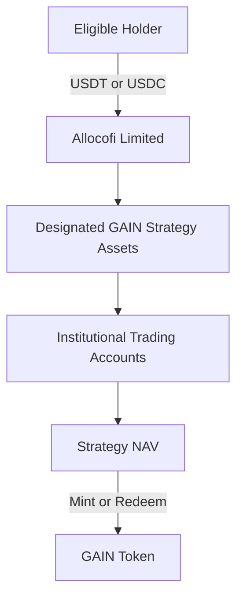

## Issuer

GAIN is issued directly by **Allocofi Limited**, a company incorporated in the British Virgin Islands.

| Item | Details |
| --- | --- |
| Legal Name | Allocofi Limited |
| Company Number | 2212410 |
| Date of Incorporation | 26 June 2026 |
| Jurisdiction | British Virgin Islands |
| Registered Office | Unit 8, 3/F., Qwomar Trading Complex, Blackburne Road, Port Purcell, Road Town, Tortola, British Virgin Islands, VG1110 |
| Product | GAIN Token |
| Issuer | Allocofi Limited |
| Strategy Manager | Allocofi Limited |

<Info>
  Incorporation in the British Virgin Islands confirms the legal existence of Allocofi Limited. It does not, by itself, constitute a financial-services licence, regulatory approval or endorsement of GAIN by the British Virgin Islands Financial Services Commission.
</Info>

## Direct Token Structure

GAIN is structured as a token issued directly by Allocofi Limited in connection with a designated digital-asset investment strategy.

It is **not** an offchain structured note represented or mirrored by a separate onchain token. The GAIN Token is the product unit through which holders receive the economic rights expressly set out in the applicable product documents.

## What the Token Represents

Subject to the definitive product terms, each GAIN Token represents:

- a proportional economic interest in the net assets attributed to the GAIN strategy;
- participation in increases or decreases in the applicable NAV;
- the right to request redemption in accordance with the applicable NAV, liquidity conditions, redemption gate and settlement terms; and
- the right to receive the disclosures and notices specified in the product documents.

The legal rights attached to GAIN arise from the product terms and the issuer's obligations. Possession of the Token alone does not create rights beyond those documents.

<Warning>
  GAIN is an investment product. It is not a bank deposit, payment account, guaranteed-value stablecoin or deposit-insured product. Principal and returns are not guaranteed.
</Warning>

## What the Token Does Not Represent

Unless the definitive product documents expressly provide otherwise, holding GAIN does not give a holder:

- direct legal or beneficial ownership of any particular asset or trading position;
- ownership of, or control over, an account held with Binance, OKX, Bybit, Bitget or another venue;
- a direct contractual relationship with an exchange, broker, custodian or technology provider;
- authority to instruct or withdraw assets from an underlying trading account;
- a direct claim against an exchange or other service provider; or
- a guarantee that the value of GAIN will remain equal to its initial NAV.

## Asset Attribution and Separate Accounting

Assets and liabilities attributable to GAIN are recorded separately from:

- Allocofi Limited's operating funds;
- assets associated with other products or strategies; and
- amounts not attributable to GAIN holders.

Dedicated books, internal account identifiers and reconciliation procedures are used to determine the assets, liabilities, income, expenses and NAV attributable to GAIN.

<Info>
  Separate accounting supports product-level identification and reconciliation. Unless the final legal structure creates statutory segregation, it should not be interpreted as an absolute guarantee that GAIN assets are bankruptcy remote from Allocofi Limited or unaffected by the insolvency of an exchange, custodian or other counterparty.
</Info>

## Issuer and Strategy-Management Roles

Allocofi Limited acts as both the issuer of GAIN and the manager of the underlying strategy. In these roles, it is responsible for functions that may include:

- accepting or rejecting subscriptions and redemption requests;
- minting and burning GAIN Tokens;
- allocating assets to approved trading venues and strategy accounts;
- implementing and monitoring the investment strategy;
- calculating or arranging the calculation of NAV;
- maintaining product-level records and reconciliations;
- applying risk, liquidity and exposure limits; and
- publishing product disclosures and material notices.

Because the issuer and strategy manager are the same entity, conflicts may arise in valuation, fee calculation, venue selection, trade allocation, liquidity management and the exercise of suspension or redemption powers. These conflicts should be governed by documented valuation, reconciliation, approval and incident-escalation procedures.

## Regulatory Perimeter

The legal classification of GAIN depends on its rights, structure, offer, distribution and operation rather than the use of the word “token.” Depending on the final arrangements, relevant BVI requirements may include those applicable to:

- investments and investment business;
- mutual, private, professional, approved or incubator funds;
- virtual-asset services;
- financial services related to the offer or sale of a virtual asset;
- investment management or administration;
- anti-money laundering, counter-terrorist financing and proliferation-financing controls; and
- sanctions, beneficial-ownership, recordkeeping and regulatory reporting obligations.

## Offering and Distribution Controls

GAIN may be offered only where the offer and use of the product are lawful. Technical access to a website or smart contract does not constitute an invitation in every jurisdiction and does not establish that a person is eligible to acquire GAIN.

The distribution framework should include:

- restrictions for prohibited jurisdictions and sanctioned persons;
- wallet and transaction screening;
- controls designed to prevent circumvention through VPNs, proxies or nominee arrangements;
- review of the securities, investment-product and virtual-asset rules applicable in each target market;
- restrictions on public solicitation where required;
- procedures for unauthorized transfers; and
- a process for suspending access when legal or sanctions conditions change.

GAIN must not be marketed as “approved,” “licensed,” “regulated” or “compliant” solely because the issuer is incorporated in the BVI.

## AML, Sanctions and Wallet Screening

Allocofi Limited may require information or take measures reasonably necessary to comply with applicable legal, sanctions and financial-crime obligations. Subject to the final compliance policy and smart-contract design, these measures may include:

- identity and beneficial-owner verification;
- source-of-funds and source-of-wealth checks;
- sanctions, politically exposed person and adverse-media screening;
- blockchain analytics and wallet-risk screening;
- transaction monitoring and investigation;
- requests for additional supporting information;
- rejection, delay or suspension of a subscription, transfer or redemption; and
- reporting or asset-restriction measures required by applicable law.

<Info>
  The precise onboarding standard must match the issuer's confirmed regulatory classification. The product documents should not state that “no eligibility verification is required” unless BVI counsel and counsel in every distribution jurisdiction have expressly approved that position.
</Info>

## Token Transfers

GAIN is technically transferable between compatible addresses, subject to the smart contract, product terms and applicable law.

Technical transferability does not mean that every transfer is legally permitted or that an ineligible recipient acquires enforceable product rights. The definitive terms should specify:

- who may legally hold GAIN;
- whether the blockchain record is the definitive holder register;
- the effect of a transfer to an ineligible or sanctioned address;
- any freeze, forced-transfer, blocking or burn powers;
- how lost keys and unsupported networks are treated; and
- whether transfers through secondary venues are recognized by the issuer.

## Smart-Contract Governance

The deployed contracts should identify and publicly disclose all privileged roles. The intended control framework includes:

| Control | Intended Standard |
| --- | --- |
| Minting | Restricted to an authorized issuer role following an accepted subscription |
| Burning | Processed through the official redemption mechanism |
| Administrative Control | Multisignature approval |
| Contract Upgrades | Multisignature approval and a disclosed timelock |
| Emergency Pause | Available for security, operational or legal incidents |
| Address Controls | Limited to sanctions, legal and security requirements described in the product terms |
| Role Separation | Issuance, operational and emergency permissions separated where practicable |
| Public Disclosure | Contract addresses, privileged roles and material changes published through official channels |

<Note>
  The final page must replace intended controls with verified deployed settings, contract addresses, multisignature parameters, timelock periods, audit reports and block-explorer links.
</Note>

## NAV, Redemption and Holder Claims

GAIN holders may request redemption only in accordance with the applicable product terms. Redemption rights remain subject to:

- the applicable daily NAV;
- the daily product-level redemption gate;
- available liquidity;
- valid wallet and transaction information;
- applicable legal, sanctions and compliance restrictions;
- market, exchange, blockchain and operational conditions; and
- any suspension, delay or early-termination provisions in the definitive documents.

A holder's redemption claim is against Allocofi Limited under the product terms. It is not a direct withdrawal right over assets held in any institutional trading account.

## Required Governing Documents

The following documents should be available before GAIN is offered:

<CardGroup cols={2}>
  <Card title="Product Terms" icon="file-contract">
    Defines the Token, holder rights, subscription, redemption, transfers, suspension and termination.
  </Card>

  <Card title="Risk Disclosure" icon="triangle-exclamation">
    Explains strategy, leverage, counterparty, liquidity, stablecoin, technology and legal risks.
  </Card>

  <Card title="NAV Methodology" icon="calculator">
    Defines valuation sources, cut-off times, liabilities, fee treatment and correction procedures.
  </Card>

  <Card title="Redemption Policy" icon="arrow-right-arrow-left">
    Sets out settlement methods, the daily gate, queues, delays, suspensions and wind-down treatment.
  </Card>

  <Card title="Privacy Policy" icon="shield-halved">
    Explains the collection, use, retention and sharing of personal information.
  </Card>

  <Card title="Website Terms" icon="globe">
    Governs access to the application, acceptable use, wallets and technology limitations.
  </Card>
</CardGroup>

If a summary, webpage or interface conflicts with the definitive product documents, the definitive documents prevail.

## Regulatory Status Disclosure

The final published version should include one counsel-approved statement selecting the position that accurately applies at launch:

<AccordionGroup>
  <Accordion title="If a licence or registration is required and obtained">
    Identify the regulated entity, regulator, exact licence or registration category, reference number and the activities covered. Do not imply that the regulator guarantees or endorses GAIN.
  </Accordion>

  <Accordion title="If the activity is outside scope or exempt">
    Identify the legal basis and limits of the exclusion or exemption, the date of the legal opinion and any conditions that must remain satisfied.
  </Accordion>

  <Accordion title="While classification remains under review">
    State that GAIN is not yet available for subscription and that launch is conditional on completion of the applicable legal and regulatory review.
  </Accordion>
</AccordionGroup>

## Official BVI References

- [BVI Financial Services Commission - Guidance on Regulation of Virtual Assets](https://www.bvifsc.vg/library/guidance-regulation-virtual-assets-virgin-islands-bvi)
- [BVI Financial Services Commission - Guidance on VASP Registration](https://www.bvifsc.vg/sites/default/files/guidance_-_application_for_vasp_registration_0_0.pdf)
- [BVI Financial Services Commission](https://www.bvifsc.vg/)

<Warning>
  GAIN involves investment, strategy, leverage, counterparty, liquidity, stablecoin, custody, smart-contract, cybersecurity, legal, regulatory and tax risks. Prospective holders should review all definitive documents and obtain independent legal, tax and investment advice before acquiring GAIN.
</Warning>