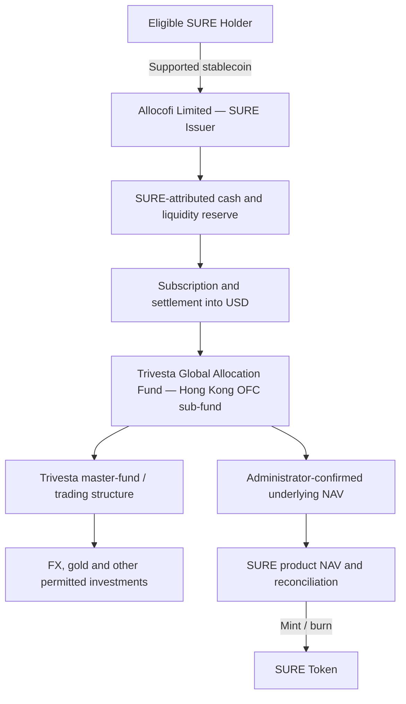

SURE connects an onchain product unit with an offchain fund investment and settlement process. The onchain token records SURE issuance, transfers and burns. The value of SURE is determined from the assets and liabilities attributed to the product, including its underlying fund exposure.

## Product Architecture

<Info>
  The diagram is a functional summary. It does not mean that SURE holders directly own the underlying fund shares, master-fund assets, trading accounts or individual positions.
</Info>

## Key Parties

| Role | Party | Primary Function |
| :-- | :-- | :-- |
| SURE Issuer | Allocofi Limited | Issues and redeems SURE, maintains product-level records and attributes assets and liabilities to SURE |
| Platform | Alloco | User interface, wallet interaction, disclosures and transaction workflow |
| Underlying Fund | Trivesta Global Allocation Fund | Private Hong Kong OFC sub-fund providing the principal investment exposure |
| Underlying Investment Manager | Trivesta Capital Management (Hong Kong) Limited | Portfolio management and investment oversight for the sub-fund |
| Underlying Administrator | Apex Fund Services (HK) Limited | Fund administration and NAV-related functions under the governing agreements |
| Underlying Custodians Named in the PPM | DBS Bank Ltd., Hong Kong Branch; Interactive Brokers Hong Kong Limited | Custody and related services for the OFC structure, subject to the governing agreements |
| Underlying Auditor | OOP CPA & Co. | Auditor of the OFC |
| Hong Kong Legal Adviser | Rowdget W. Young & Co. | Hong Kong legal adviser to the OFC |

## Subscription Process

### 1. Eligibility and Wallet Review

Before a subscription is accepted, the issuer may require:

- identity and beneficial-owner verification;
- professional-investor or other eligibility evidence;
- source-of-funds and source-of-wealth information;
- sanctions, PEP and adverse-media screening;
- blockchain analytics and wallet-risk screening; and
- any other information required by law, the issuer or an underlying service provider.

### 2. Subscription Instruction

The user selects the available SURE series, enters the subscription amount and confirms the transaction through a supported wallet.

The application should display:

- supported asset and blockchain network;
- indicative SURE NAV;
- applicable distribution objective;
- any issuance, conversion, spread or network charge;
- the expected minting window;
- the next underlying dealing cycle; and
- applicable lock-up and redemption conditions.

### 3. Acceptance and Asset Conversion

Accepted stablecoins may be held temporarily in a product wallet, converted into USD or another accepted settlement asset, and then used for:

- investment into the relevant underlying fund class;
- maintenance of an operational or accelerated-redemption reserve;
- payment of disclosed expenses; or
- other purposes permitted by the SURE product terms.

Stablecoin conversion can create spread, slippage, banking, settlement and timing risk.

### 4. Minting

SURE is minted only after the issuer accepts the subscription and completes the required valuation, compliance and reconciliation checks.

The number of units issued is calculated as:

$$
\text{SURE Units Minted}
=
\frac{\text{Net Accepted Subscription Amount}}{\text{Applicable SURE NAV per Unit}}
$$

The net accepted subscription amount may be reduced by disclosed fees, conversion costs, network costs or other product expenses.

## Underlying Dealing Cycle

The supplied underlying-fund documents state that:

- the normal Subscription Day and Redemption Day are the **first Business Day of each calendar month**;
- subscription and redemption documentation must generally be received at least **eight Business Days** before the applicable deadline;
- cleared subscription funds must generally reach the underlying subscription account at least **six Business Days** before the deadline;
- third-party payments are not accepted at underlying-fund level; and
- the official valuation is normally monthly, at the last calendar day of the month or another applicable Valuation Day.

SURE may impose an earlier application cut-off so the issuer can complete stablecoin conversion, banking, documentation and underlying-fund settlement on time.

<Warning>
  A SURE subscription made after the displayed cut-off may be held for a later dealing cycle. During that period, the user remains exposed to stablecoin, issuer, operational and settlement risks described in the product documents.
</Warning>

## NAV Methodology

### Official Underlying NAV

The official underlying-fund NAV is determined in accordance with the Trivesta OFC PPM and Appendix and is normally calculated monthly. The Administrator or another appointed valuation agent performs the relevant fund-administration and valuation functions.

### SURE Product NAV

The SURE NAV per unit is intended to be calculated as:

$$
\text{SURE NAV per Unit}
=
\frac{
\text{Underlying Fund Value}
+
\text{Attributed Cash and Receivables}
-
\text{Attributed Liabilities and Expenses}
}{
\text{Valid SURE Units Outstanding}
}
$$

Attributed liabilities and expenses may include:

- accrued underlying-fund fees and expenses;
- SURE-level fees and operating expenses;
- conversion, banking, custody and network costs;
- accrued but unpaid redemptions or distributions;
- taxes, reserves and other permitted liabilities; and
- valuation adjustments or provisions.

### Indicative NAV

Alloco may publish an indicative intramonth value using the latest official underlying NAV, cash movements, distributions, expenses and other available data.

<Warning>
  An indicative NAV is not an official underlying-fund NAV and may not capture current trading gains, losses, liabilities or valuation adjustments. Minting and redemption settle at the NAV specified in the definitive SURE terms, not necessarily the most recently displayed indicative value.
</Warning>

## Monthly Distributions

The underlying fund intends, subject to market conditions, to pay monthly distributions at annualized rates of:

| Underlying Class | Annualized Distribution Objective |
| :-- | --: |
| Class A | 8% |
| Class B | 9% |
| Class C | 10% |

For SURE:

- the applicable objective is the rate shown for the relevant SURE series;
- the issuer may receive, retain, convert, reinvest or distribute underlying payments as set out in the SURE terms;
- distributions may be paid in a supported stablecoin or reflected in the product NAV;
- a distribution reduces the assets remaining in the product unless it is funded by new income or appreciation; and
- distributions are not guaranteed and may be amended, reduced, delayed or suspended.

<Info>
  A monthly payment should not be interpreted as interest on a deposit. It may be sourced from income, realized or unrealized gains, capital or other amounts permitted by the governing documents.
</Info>

## Redemption Process

### Standard Redemption

1. The holder submits a redemption request through Alloco.
2. SURE units are locked or transferred to the official redemption contract or wallet.
3. The issuer validates the holder, wallet, amount and applicable compliance status.
4. The request is matched to the next available underlying redemption cycle or available product cash.
5. The applicable SURE NAV is determined.
6. SURE units are burned.
7. Net proceeds are transferred to the approved wallet in the supported redemption asset.

The underlying documents state that redemption proceeds are normally paid within **one calendar month after calculation of the relevant underlying NAV**, subject to complete documentation, available liquidity, suspensions, gates and other governing terms.

### Three-Month Soft Lock-Up

The underlying fund applies a three-month soft lock-up from payment of the initial subscription amount. A redemption during that period may incur a **1% redemption charge**. The investment manager may reduce or waive that charge.

SURE may apply the underlying charge, a product-level equivalent or a pro-rata allocation of the charge, as specified before subscription.

### Accelerated Redemption

Alloco may offer accelerated redemption from available product liquidity.

Accelerated redemption:

- is not a direct same-day redemption from the underlying fund;
- is available only when the issuer has sufficient liquid assets;
- may be subject to a fee, spread, quota or minimum amount;
- may use an indicative price or a haircut pending the next official NAV; and
- may be suspended without prior notice during market, banking, stablecoin, blockchain or operational disruption.

### Gates, Deferrals and Suspensions

Redemptions may be limited, deferred or suspended where permitted by the SURE terms or the underlying documents, including when:

- underlying NAV calculation is suspended;
- markets or banks are closed or disrupted;
- positions cannot be valued or liquidated reliably;
- redemption requests exceed an applicable gate;
- the underlying fund elects to pay in kind;
- a counterparty, custodian or bank restricts transfers;
- a blockchain or stablecoin incident occurs; or
- legal, sanctions or compliance restrictions apply.

## Fees and Expenses

| Fee or Expense | Treatment |
| :-- | :-- |
| Underlying Management Fee | Up to 2% per annum of the relevant underlying NAV |
| Underlying Subscription Fee | Up to 5%, determined generally or case by case |
| Underlying Initial Charge | Nil |
| Underlying Performance Fee | 100% of net new profit above the applicable class hurdle and high-water mark, as described in the Appendix |
| Underlying Custody, Administration and Operating Costs | Paid from the underlying fund at agreed or incurred rates |
| SURE Issuance, Redemption, Conversion or Liquidity Fees | Displayed in the application and governed by the SURE terms |
| Blockchain Network Costs | Paid by the user or product as disclosed |
| Stablecoin and Banking Conversion Costs | Reflected in the transaction amount, product expenses or NAV, as applicable |

<Warning>
  The underlying performance-fee design means investors generally do not participate in performance above the applicable 8%, 9% or 10% hurdle after the adjustments described in the Appendix. The exact economic result for SURE also depends on issuer-level fees, cash timing, conversion costs and the SURE series terms.
</Warning>

## Onchain Supply and Reconciliation

The issuer should reconcile:

- valid SURE units outstanding;
- accepted subscriptions not yet minted;
- units pending redemption or burn;
- attributed stablecoin and bank balances;
- underlying fund shares or receivables;
- distributions and accrued expenses; and
- any difference between official and indicative NAV.

Onchain token supply is publicly observable, but the offchain asset position must be supported by product records, underlying statements and reconciliation.

## Operational Corrections

The issuer may correct an erroneous mint, burn, NAV, distribution or transaction record in accordance with the product terms. Material corrections should be disclosed through official channels as reasonably practicable.

<Warning>
  No operational process, liquidity reserve, smart contract or reconciliation system can guarantee uninterrupted subscriptions, distributions or redemptions.
</Warning>