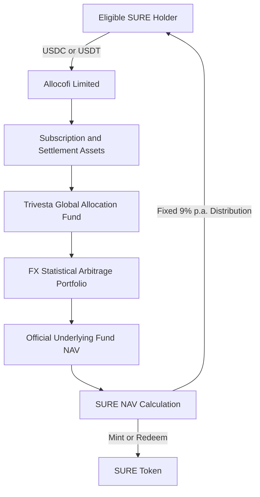

SURE is an onchain token designed to track the economic value of the **Trivesta Global Allocation Fund**, whose designated mandate is **foreign-exchange statistical arbitrage only**.

The Token does not independently operate the foreign-exchange strategy. Instead, SURE records the holder's proportional economic exposure to the assets and liabilities attributed to the underlying Fund-tracking structure.

<CardGroup cols={3}>
  <Card title="Track" icon="chart-line">
    SURE NAV tracks the applicable net value of the underlying Trivesta Fund exposure.
  </Card>

  <Card title="Distribute" icon="calendar-days">
    SURE provides a fixed 9% annual distribution, normally paid monthly.
  </Card>

  <Card title="Redeem" icon="arrow-right-arrow-left">
    SURE units may be redeemed in accordance with the applicable NAV, dealing cycle and liquidity terms.
  </Card>
</CardGroup>

## Fund-Tracking Structure

<Info>
  SURE tracks the economic value of the underlying Fund. Holding SURE does not automatically transfer direct ownership of individual Fund shares, FX positions, trading accounts or custody accounts to the Token holder.
</Info>

## Subscription and Minting

<Steps>
  <Step title="Submit Subscription">
    The user selects SURE, enters the subscription amount and transfers USDC or USDT through a supported network.
  </Step>
  <Step title="Complete Compliance Review">
    The issuer may verify identity, investor eligibility, source of funds, sanctions status and wallet risk before accepting the subscription.
  </Step>
  <Step title="Convert and Settle">
    Accepted stablecoins may be converted into USD and transferred through the applicable banking and Fund-subscription process.
  </Step>
  <Step title="Allocate to the Underlying Fund">
    The accepted net subscription amount is attributed to SURE and allocated to the Trivesta Fund or retained temporarily as an approved settlement or liquidity reserve.
  </Step>
  <Step title="Mint SURE">
    Once settlement, valuation and reconciliation checks are completed, SURE units are minted at the applicable NAV per unit.
  </Step>
</Steps>

The number of SURE units issued is calculated as:

$$
\text{SURE Units Minted}
=
\frac{
\text{Net Accepted Subscription Amount}
}{
\text{Applicable SURE NAV per Unit}
}
$$

The net accepted subscription amount may reflect disclosed fees, conversion costs and blockchain network costs.

## NAV Tracking

### Underlying Fund NAV

The official underlying Fund NAV is calculated in accordance with the Fund's governing documents and valuation procedures.

It reflects the value of:

- open and closed foreign-exchange positions;
- cash and cash equivalents;
- margin and collateral;
- realized and unrealized trading profit or loss;
- accrued fees and expenses;
- pending subscriptions and redemptions; and
- other Fund assets and liabilities.

### SURE NAV

SURE NAV is calculated from the net assets attributed to SURE:

$$
\text{SURE NAV per Unit}
=
\frac{
\text{Underlying Fund Value}
+
\text{Attributed Cash and Receivables}
-
\text{Attributed Liabilities and Expenses}
}{
\text{Valid SURE Units Outstanding}
}
$$

Attributed liabilities and expenses may include:

- accrued Fund fees and expenses;
- SURE operating expenses;
- stablecoin and banking conversion costs;
- accrued monthly distributions;
- pending redemption liabilities;
- taxes and reserves; and
- valuation adjustments or provisions.

### Tracking Difference

SURE NAV may not exactly equal the published underlying Fund NAV per share because SURE may hold cash, accrue distributions, incur product-level costs or process subscriptions and redemptions at different times.

A simplified tracking difference is:

$$
\text{Tracking Difference}
=
\text{SURE Total Return}
-
\text{Underlying Fund Total Return}
$$

Tracking difference may arise from:

- stablecoin-to-USD conversion;
- subscription and redemption timing;
- cash held for liquidity;
- product-level fees and expenses;
- distribution timing;
- rounding and token supply;
- delayed or corrected Fund NAV; and
- operational settlement differences.

<Warning>
  An indicative SURE NAV is not the same as an official underlying Fund NAV. It may not reflect current intramonth trading gains, losses, liabilities or valuation adjustments.
</Warning>

## Fixed 9% Distribution

SURE provides a single fixed annual distribution rate of **9%**, normally paid monthly.

The standard monthly rate is:

$$
\text{Monthly Distribution Rate}
=
\frac{9\%}{12}
=
0.75\%
$$

The monthly distribution amount is calculated as:

$$
\text{Monthly Distribution}
=
\text{Eligible Distribution Balance}
\times
0.75\%
$$

The definitive product terms specify:

- the eligible distribution balance;
- record date;
- accrual convention;
- payment date;
- supported payment asset;
- treatment of partial months;
- treatment of pending subscriptions and redemptions; and
- rounding and tax treatment.

### Distribution Characteristics

- SURE has one fixed annual distribution rate: 9%.
- There are no alternative distribution classes or rate tiers.
- Distributions are normally paid monthly.
- A monthly distribution is not the same as monthly strategy profit.
- If the underlying Fund earns more than the distribution amount, the remaining value may support NAV after fees and expenses.
- If the underlying Fund earns less than the distribution amount, the payment may reduce SURE NAV or available reserves.
- Principal is not protected.

## Redemption

### Standard Redemption

<Steps>
  <Step title="Submit Request">
    The holder submits a redemption request through the Alloco application.
  </Step>
  <Step title="Lock SURE Units">
    The requested units are locked or transferred to the official redemption contract or wallet.
  </Step>
  <Step title="Match the Fund Dealing Cycle">
    The request is processed using available product cash or the next applicable underlying Fund redemption cycle.
  </Step>
  <Step title="Determine Redemption NAV">
    The applicable SURE NAV is calculated after recognizing relevant fees, expenses and liabilities.
  </Step>
  <Step title="Burn and Settle">
    Redeemed SURE units are burned and the net redemption proceeds are transferred to the approved wallet.
  </Step>
</Steps>

### Early Redemption

The underlying structure applies a three-month lock-up period. Redemptions during the lock-up period may be subject to an early redemption charge of up to 1%.

### Accelerated Redemption

Accelerated redemption may be offered using available product liquidity.

It may:

- be subject to a fee or spread;
- be limited by a liquidity quota;
- use an indicative NAV or adjustment;
- be unavailable during market or operational disruption; and
- be suspended when liquidity is insufficient.

### Redemption Gates and Suspensions

Redemptions may be delayed, limited or suspended when:

- the underlying Fund NAV cannot be determined reliably;
- FX markets or banking systems are disrupted;
- positions cannot be liquidated efficiently;
- redemption demand exceeds available liquidity;
- a broker, bank or custodian restricts transfers;
- a stablecoin or blockchain incident occurs; or
- legal, sanctions or compliance restrictions apply.

## Token Supply and Reconciliation

The issuer should reconcile:

- valid SURE units outstanding;
- subscriptions accepted but not yet minted;
- units pending redemption;
- units burned;
- stablecoin and bank balances;
- the underlying Fund position;
- accrued distributions;
- fees and expenses; and
- differences between official and indicative NAV.

<Info>
  Onchain supply shows how many SURE units exist. It does not by itself prove the value, ownership or liquidity of the underlying Fund position.
</Info>

## Fees and Expenses

| Fee or Expense | Treatment |
| :-- | :-- |
| Underlying Fund Fees | Reflected in the official underlying Fund NAV |
| SURE Subscription Fee | Displayed in the application |
| SURE Redemption Fee | Displayed in the application |
| Early Redemption Charge | Up to 1% during the lock-up period |
| Accelerated Redemption Fee | Displayed before confirmation |
| Stablecoin and Banking Conversion Costs | Reflected in transaction proceeds or SURE NAV |
| Blockchain Network Costs | Paid by the user or product as disclosed |
| Administration, Custody and Operating Expenses | Reflected in the underlying Fund NAV or SURE NAV |

<Warning>
  No minting, tracking, reconciliation or liquidity process can guarantee uninterrupted subscriptions, accurate intramonth valuation, monthly distributions or redemption settlement.
</Warning>