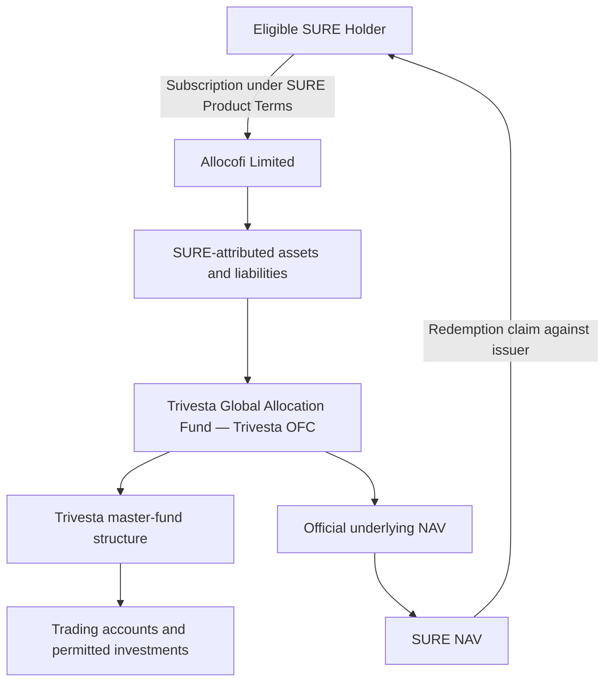

## SURE Issuer

SURE is intended to be issued directly by **Allocofi Limited** and distributed through Alloco.

| Item | Details |
| :-- | :-- |
| Legal Name | Allocofi Limited |
| Company Number | 2212410 |
| Date of Incorporation | 26 June 2026 |
| Jurisdiction | British Virgin Islands |
| Registered Office | Unit 8, 3/F., Qwomar Trading Complex, Blackburne Road, Port Purcell, Road Town, Tortola, British Virgin Islands, VG1110 |
| Product | SURE Token |
| Issuer | Allocofi Limited |
| Platform | Alloco |
| Principal Underlying Investment | Trivesta Global Allocation Fund |

<Info>
  BVI incorporation confirms the legal existence of Allocofi Limited. It does not, by itself, constitute a financial-services licence, regulatory approval or endorsement of SURE by the BVI Financial Services Commission or any other regulator.
</Info>

## Legal Structure

SURE is a token issued by Allocofi Limited in connection with assets and liabilities attributed to the SURE product. The principal intended investment exposure is an issuer-held interest in the Trivesta Global Allocation Fund or related settlement assets.

SURE is not merely a digital certificate that automatically transfers legal ownership of a named underlying fund share to each wallet holder. Holder rights must be defined in the definitive SURE product terms.

## What SURE Represents

Subject to the definitive documents, each valid SURE unit is intended to represent:

- a proportional economic interest in the net assets attributed to the relevant SURE series;
- participation in increases and decreases in the applicable SURE NAV;
- entitlement to distributions declared for that SURE series;
- the right to request redemption under the applicable dealing, liquidity and compliance conditions; and
- the right to receive the disclosures and notices specified in the product documents.

## What SURE Does Not Represent

Unless the definitive product documents expressly provide otherwise, holding SURE does not give a holder:

- direct legal title to a specific share of Trivesta OFC or the Trivesta Global Allocation Fund;
- direct legal or beneficial ownership of a Cayman master-fund asset or trading position;
- ownership of, or control over, any bank, broker, custody or trading account;
- authority to instruct Trivesta, Apex, DBS, Interactive Brokers or another service provider;
- a direct contractual claim against an underlying broker, bank, custodian or administrator;
- voting rights in the underlying OFC;
- a guaranteed redemption date or value; or
- a guarantee that SURE will maintain its initial NAV.

<Warning>
  A SURE holder's contractual claim is against Allocofi Limited under the SURE product terms. The holder may therefore be exposed to issuer-credit, insolvency and enforcement risk in addition to underlying investment risk.
</Warning>

## Underlying Hong Kong Fund

The principal underlying investment is the **Trivesta Global Allocation Fund**, a private sub-fund of **Trivesta OFC**.

| Item | Details |
| :-- | :-- |
| OFC | Trivesta OFC |
| OFC SFC Reference | BVK550 |
| Sub-Fund | Trivesta Global Allocation Fund |
| Sub-Fund SFC Reference | BVK551 |
| Structure | Hong Kong private umbrella open-ended fund company with segregated sub-funds |
| Base Currency | USD |
| Eligible Underlying Investors | Professional investors |
| Public Offering | Not authorized for public offer in Hong Kong |
| Investment Manager | Trivesta Capital Management (Hong Kong) Limited |

SFC registration is not a recommendation, guarantee or endorsement of the OFC, the sub-fund, SURE or their performance.

<Info>
  Hong Kong law provides for segregated liability between OFC sub-funds. The PPM warns that a foreign court or foreign-law contract may not necessarily recognize that segregation in the same way.
</Info>

## Investment Manager Regulatory Status

The supplied SFC licence identifies **Trivesta Capital Management (Hong Kong) Limited** as licensed for:

- **Type 4 — Advising on Securities**; and
- **Type 9 — Asset Management**.

The licence includes conditions stating that the licensee:

- shall not hold client assets; and
- in relation to Type 9 activity, shall provide services only to professional investors.

<Warning>
  The SFC licence applies to the licensed Hong Kong entity and the regulated activities covered by that licence. It does not automatically license Allocofi Limited, approve the SURE Token, approve a Cayman master fund or permit public distribution in every jurisdiction.
</Warning>

## Underlying Service Providers

The supplied Trivesta PPM identifies:

| Function | Party |
| :-- | :-- |
| Investment Manager | Trivesta Capital Management (Hong Kong) Limited |
| Administrator | Apex Fund Services (HK) Limited |
| Custodians Named in the PPM | DBS Bank Ltd., Hong Kong Branch; Interactive Brokers Hong Kong Limited |
| Auditor | OOP CPA & Co. |
| Hong Kong Legal Adviser | Rowdget W. Young & Co. |

The precise scope, current appointment status and master-fund-level responsibilities of each party should be confirmed from current signed agreements and direct independent evidence.

## Master-Fund Structure

The supplied DDQ identifies **Trivesta Fund SPC** in the Cayman Islands as the intended master fund and stated that CIMA registration was being applied for at the time of response.

Before SURE is made available, the issuer should obtain and retain:

- the current legal name and registered address;
- the current CIMA registration number, exemption or other legal basis;
- the current investment-manager and trading-delegation arrangements;
- current bank, prime-broker, execution and custody agreements;
- confirmation of how the administrator verifies master-fund assets and liabilities; and
- current audited financial statements or administrator statements when available.

<Warning>
  No public statement should describe the master fund as registered, regulated, independently custodied or operational with a named broker unless that statement has been verified as current.
</Warning>

## Offering and Eligibility Controls

SURE may be offered only where lawful. Technical access to a website, wallet or smart contract does not establish that a person is legally eligible to acquire or hold SURE.

The distribution framework should include:

- professional-investor or other applicable investor-qualification controls;
- restricted-jurisdiction controls;
- sanctions and prohibited-person screening;
- restrictions on public solicitation where required;
- review of securities, fund, structured-product and virtual-asset rules in each target market;
- controls against VPN, proxy, nominee or other circumvention;
- procedures for unauthorized transfers; and
- the ability to suspend access when laws or sanctions change.

SURE must not be used to bypass the private-offer and professional-investor limitations applicable to the underlying fund.

## AML, Sanctions and Wallet Screening

Allocofi Limited may require or perform:

- identity and beneficial-owner verification;
- source-of-funds and source-of-wealth checks;
- sanctions, PEP and adverse-media screening;
- blockchain analytics and wallet-risk screening;
- transaction monitoring and investigation;
- requests for supporting documentation;
- rejection, delay or suspension of subscriptions, transfers or redemptions; and
- reporting, freezing or restriction measures required by applicable law.

Third-party payments or redemptions to a wallet or account not verified as belonging to the eligible holder may be rejected.

## Token Transfers

Technical transferability does not mean every transfer is legally recognized.

The definitive terms should specify:

- who may acquire and hold SURE;
- whether the blockchain record is the definitive holder register;
- whether transfer restrictions are enforced onchain or contractually;
- the effect of transfer to an ineligible, sanctioned or unsupported address;
- any freeze, block, forced-transfer or burn powers;
- treatment of lost keys and unsupported networks;
- whether secondary-market transfers are recognized by the issuer; and
- how beneficial ownership and tax reporting are maintained after transfer.

## Smart-Contract Governance

The final deployed contracts should disclose:

| Control | Required Disclosure |
| :-- | :-- |
| Minting | Authorized role and acceptance conditions |
| Burning | Official redemption process and burn authority |
| Administrative Control | Multisignature signers and approval threshold |
| Contract Upgrades | Upgrade authority and timelock |
| Emergency Pause | Trigger, authority and consequences |
| Address Controls | Legal, sanctions and security powers |
| Role Separation | Issuance, operational and emergency permissions |
| Supported Networks | Official chain IDs and verified contract addresses |
| Independent Review | Audit or review provider, scope and report |
| Material Changes | Notice process and effective date |

<Note>
  Before launch, replace this table's requirements with verified deployed settings, block-explorer links, contract addresses, multisignature parameters, timelock periods and audit reports.
</Note>

## Conflicts of Interest

Potential conflicts may arise because:

- Allocofi Limited issues SURE and may manage its liquidity, valuation inputs and redemption process;
- SURE may rely on information supplied by the underlying manager or administrator;
- underlying fees may be payable to the investment manager;
- the underlying performance fee captures performance above the class hurdle;
- the issuer may choose how much liquidity to retain versus invest;
- accelerated redemption pricing may differ from the next official underlying NAV; and
- affiliated parties may receive fees or commercial benefits.

Conflicts should be governed by documented valuation, reconciliation, approval, best-execution, fee, allocation and incident-escalation procedures.

## Required Governing Documents

<CardGroup cols={2}>
  <Card title="SURE Product Terms" icon="file-contract">
    Defines the token, holder rights, subscriptions, distributions, redemptions, transfers, suspensions and termination.
  </Card>

  <Card title="Risk Disclosure" icon="triangle-exclamation">
    Explains investment, leverage, counterparty, custody, liquidity, stablecoin, technology and legal risks.
  </Card>

  <Card title="NAV Methodology" icon="calculator">
    Defines official and indicative NAV, valuation sources, liabilities, fee treatment and correction procedures.
  </Card>

  <Card title="Redemption Policy" icon="arrow-right-arrow-left">
    Defines standard and accelerated settlement, cut-offs, gates, queues, suspensions and wind-down treatment.
  </Card>

  <Card title="Restricted-Jurisdiction Policy" icon="earth-americas">
    Defines who may not access, acquire, hold or transfer SURE.
  </Card>

  <Card title="Privacy and AML Notices" icon="shield-halved">
    Explain data collection, screening, retention, reporting and user rights.
  </Card>

  <Card title="Smart-Contract Disclosure" icon="code">
    Identifies official contracts, supported networks, privileged roles and audit status.
  </Card>

  <Card title="Underlying Offering Documents" icon="folder-open">
    Includes the current Trivesta OFC PPM, sub-fund Appendix and relevant subscription documents.
  </Card>
</CardGroup>

If a website, interface, summary, translation or marketing document conflicts with the definitive governing documents, the definitive documents prevail.

## Launch Conditions

Before SURE is opened for subscription, the issuer should complete and document:

1. BVI legal classification of the SURE issuance, management and distribution model.
2. Legal analysis in each target distribution jurisdiction.
3. Confirmation of the current Cayman master-fund regulatory status.
4. Confirmation of master-fund banking, execution, custody and administration.
5. Final SURE fee, distribution, NAV and redemption terms.
6. Professional-investor and restricted-jurisdiction controls.
7. AML, sanctions and wallet-screening procedures.
8. Stablecoin conversion, treasury and banking arrangements.
9. Smart-contract deployment, multisignature governance and independent review.
10. Product-level accounting, reconciliation, incident response and wind-down procedures.

<Warning>
  SURE is an investment product, not a bank deposit, payment account, guaranteed-value stablecoin or deposit-insured product. Principal, NAV, liquidity and distributions are not guaranteed. Prospective holders should review all definitive documents and obtain independent legal, tax and investment advice.
</Warning>