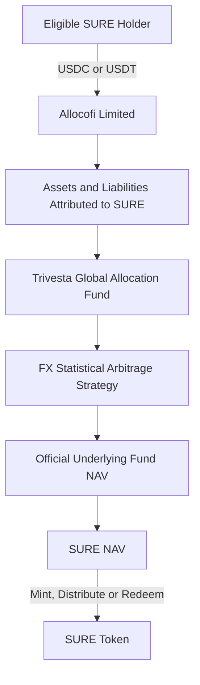

## Issuer

SURE is issued by **Allocofi Limited**, a company incorporated in the British Virgin Islands.

| Item | Details |
| :-- | :-- |
| Legal Name | Allocofi Limited |
| Company Number | 2212410 |
| Date of Incorporation | 26 June 2026 |
| Jurisdiction | British Virgin Islands |
| Registered Office | Unit 8, 3/F., Qwomar Trading Complex, Blackburne Road, Port Purcell, Road Town, Tortola, British Virgin Islands, VG1110 |
| Product | SURE Token |
| Issuer | Allocofi Limited |
| Platform | Alloco |
| Underlying Fund | Trivesta Global Allocation Fund |
| Investment Manager | Trivesta Capital Management (Hong Kong) Limited |
| Strategy | Foreign Exchange Statistical Arbitrage |
| Distribution | Fixed at 9% p.a., normally paid monthly |

<Info>
  Incorporation in the British Virgin Islands confirms the legal existence of Allocofi Limited. It does not, by itself, constitute a financial-services licence, regulatory approval or endorsement of SURE by the British Virgin Islands Financial Services Commission or any other regulator.
</Info>

## Fund-Tracking Token Structure

SURE is structured as an onchain Token issued by Allocofi Limited to track the economic value of an underlying Fund position.

The SURE Token is the product unit through which holders receive the economic rights expressly set out in the applicable product documents.

## What the Token Represents

Subject to the definitive product terms, each SURE Token represents:

- a proportional economic interest in the net assets attributed to SURE;
- economic exposure to the applicable underlying Trivesta Fund position;
- participation in increases or decreases in SURE NAV;
- entitlement to the fixed 9% annual distribution under the applicable distribution terms;
- the right to request redemption in accordance with the applicable NAV, liquidity, lock-up and settlement terms; and
- the right to receive the disclosures and notices specified in the product documents.

The legal rights attached to SURE arise from the product terms and the issuer's obligations. Possession of the Token alone does not create rights beyond those documents.

<Warning>
  SURE is an investment product. It is not a bank deposit, payment account, guaranteed-value stablecoin or deposit-insured product. The distribution rate is fixed, but principal and total return are not guaranteed.
</Warning>

## What the Token Does Not Represent

Unless the definitive product documents expressly provide otherwise, holding SURE does not give a holder:

- direct legal title to a specific share of the Trivesta Fund;
- direct legal or beneficial ownership of an individual FX position;
- ownership of, or control over, a Fund bank, broker, custody or trading account;
- authority to instruct the investment manager, administrator, custodian or broker;
- a direct contractual relationship with an underlying service provider;
- a direct claim against a bank, broker, custodian or administrator;
- voting rights in the underlying Fund;
- a guaranteed redemption date or value; or
- a guarantee that SURE NAV will remain equal to its initial value.

## Fixed 9% Distribution

SURE provides one fixed annual distribution rate of **9%**, normally paid monthly at **0.75%** of the eligible distribution balance.

There are no alternative rate tiers or distribution classes for SURE.

The definitive product terms should specify:

- the eligible distribution balance;
- record date;
- accrual convention;
- payment date;
- supported payment asset;
- treatment of partial months;
- treatment of pending subscriptions and redemptions;
- tax withholding;
- rounding;
- payment-delay or suspension events; and
- treatment upon termination or wind-down.

### Fixed Distribution Does Not Mean Fixed Total Return

The distribution rate is fixed, but:

- SURE NAV may increase or decrease;
- distributions may reduce SURE NAV;
- principal is not protected;
- issuer and underlying Fund risk apply;
- redemption may be delayed; and
- users may lose some or all of their invested capital.

## Underlying Fund

The principal underlying investment tracked by SURE is the **Trivesta Global Allocation Fund**, a private sub-fund of **Trivesta OFC**.

| Item | Details |
| :-- | :-- |
| OFC | Trivesta OFC |
| Sub-Fund | Trivesta Global Allocation Fund |
| Structure | Hong Kong private open-ended fund company sub-fund |
| Base Currency | USD |
| Eligible Underlying Investors | Professional investors |
| Public Offering | Not authorized for public offer in Hong Kong |
| Investment Manager | Trivesta Capital Management (Hong Kong) Limited |
| SURE-Linked Mandate | Foreign Exchange Statistical Arbitrage Only |
| SURE-Linked Distribution | Fixed at 9% p.a. |

<Info>
  The binding Fund and product documents used for SURE must reflect the FX-only mandate and the single fixed 9% distribution structure before SURE is made available.
</Info>

SFC registration or licensing:

- does not represent an endorsement of SURE;
- does not guarantee the performance of the underlying Fund;
- does not guarantee principal;
- does not approve the fixed 9% distribution; and
- does not automatically permit SURE distribution in another jurisdiction.

## Investment Manager

The supplied licence materials identify **Trivesta Capital Management (Hong Kong) Limited** as licensed for:

- Type 4 — Advising on Securities; and
- Type 9 — Asset Management.

The licence conditions state that the investment manager:

- shall not hold client assets; and
- shall provide its Type 9 services only to professional investors.

The licence applies to the regulated Hong Kong entity and its licensed activities. It does not automatically license Allocofi Limited or approve the SURE Token.

## Underlying Service Providers

The underlying Fund documents identify:

| Function | Party |
| :-- | :-- |
| Investment Manager | Trivesta Capital Management (Hong Kong) Limited |
| Administrator | Apex Fund Services (HK) Limited |
| Custodians Named in the Fund Documents | DBS Bank Ltd., Hong Kong Branch; Interactive Brokers Hong Kong Limited |
| Auditor | OOP CPA & Co. |
| Hong Kong Legal Adviser | Rowdget W. Young & Co. |

The current appointment status and precise responsibilities of each service provider remain subject to the definitive Fund agreements.

## Investor Eligibility and Regional Restrictions

SURE may be offered only where lawful.

Eligibility and distribution controls may include:

- professional-investor or qualified-investor verification;
- restricted-jurisdiction controls;
- identity and beneficial-owner verification;
- sanctions and prohibited-person screening;
- source-of-funds and source-of-wealth review;
- blockchain wallet-risk screening;
- restrictions on public solicitation;
- restrictions on unauthorized secondary transfers; and
- suspension of access when legal or regulatory requirements change.

Technical access to a website, wallet or smart contract does not establish legal eligibility to acquire or hold SURE.

## AML, Sanctions and Wallet Screening

Allocofi Limited may:

- request identity and beneficial-owner information;
- conduct source-of-funds and source-of-wealth checks;
- conduct sanctions, PEP and adverse-media screening;
- use blockchain analytics and wallet-risk screening;
- monitor subscriptions, transfers and redemptions;
- request supporting documentation;
- delay or reject a transaction; and
- freeze, restrict or report activity where required by law.

Third-party payments or redemptions to an unverified wallet or account may be rejected.

## Token Transfers

Technical transferability does not mean that every transfer is legally permitted or recognized.

The definitive product terms should specify:

- who may acquire and hold SURE;
- whether prior eligibility approval is required;
- whether the blockchain record is the definitive holder register;
- whether transfer restrictions are enforced onchain;
- the effect of transfer to an ineligible or sanctioned address;
- freeze, block, forced-transfer or burn powers;
- treatment of lost private keys;
- treatment of unsupported networks;
- whether secondary-market transfers are recognized; and
- how beneficial ownership and tax reporting are maintained.

## Smart Contract Governance

| Control | Required Disclosure |
| :-- | :-- |
| Minting | Authorized role and subscription-acceptance conditions |
| Burning | Official redemption and burn process |
| Administrative Control | Multisignature signers and approval threshold |
| Contract Upgrades | Upgrade authority and applicable timelock |
| Emergency Pause | Trigger, authority and consequences |
| Address Controls | Legal, sanctions and security powers |
| Supported Networks | Official chain IDs and verified contract addresses |
| Independent Review | Smart-contract audit or review provider, scope and report |
| Material Changes | Notice process and effective date |

## Conflicts of Interest

Potential conflicts may arise because:

- Allocofi Limited issues SURE and manages product-level cash and liquidity;
- the issuer calculates or approves SURE NAV using underlying Fund data;
- the underlying investment manager receives Fund fees;
- the fixed distribution may be paid while SURE NAV declines;
- the issuer may determine accelerated-redemption pricing;
- the issuer may decide how much cash to retain rather than invest; and
- affiliated parties may receive fees or commercial benefits.

Conflicts should be governed by documented valuation, reconciliation, approval, fee, allocation and incident-escalation procedures.

## Governing Documents

<CardGroup cols={2}>
  <Card title="SURE Product Terms" icon="file-contract">
    Defines Token-holder rights, subscriptions, the fixed 9% distribution, redemptions, transfers, suspensions and termination.
  </Card>

  <Card title="Fund-Tracking and NAV Methodology" icon="calculator">
    Defines the underlying Fund reference, SURE NAV, liabilities, tracking difference and correction procedures.
  </Card>

  <Card title="FX-Only Investment Mandate" icon="money-bill-transfer">
    Legally restricts the SURE-linked underlying allocation to foreign-exchange statistical arbitrage.
  </Card>

  <Card title="Distribution Policy" icon="calendar-days">
    Defines the single 9% annual rate, monthly calculation and payment treatment.
  </Card>

  <Card title="Risk Disclosure" icon="triangle-exclamation">
    Explains strategy, market, model, leverage, counterparty, liquidity, stablecoin and technology risks.
  </Card>

  <Card title="Redemption Policy" icon="arrow-right-arrow-left">
    Defines dealing dates, lock-up, accelerated redemption, gates, queues and suspensions.
  </Card>

  <Card title="Restricted-Jurisdiction Policy" icon="earth-americas">
    Defines who may not access, acquire, hold or transfer SURE.
  </Card>

  <Card title="Smart-Contract Disclosure" icon="code">
    Identifies official contracts, supported networks, privileged roles and audit status.
  </Card>
</CardGroup>

If an application screen, website, marketing document, translation or summary conflicts with the definitive governing documents, the definitive governing documents prevail.

<Warning>
  SURE is a fund-tracking investment Token, not a bank deposit, payment account or principal-protected instrument. The fixed 9% annual distribution does not guarantee a stable NAV, uninterrupted payment, liquidity or the return of invested capital. Users should review all definitive documents and obtain independent legal, tax and investment advice.
</Warning>