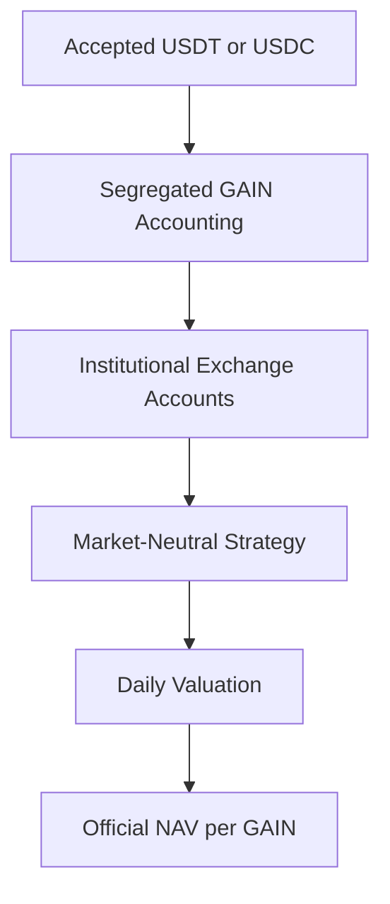
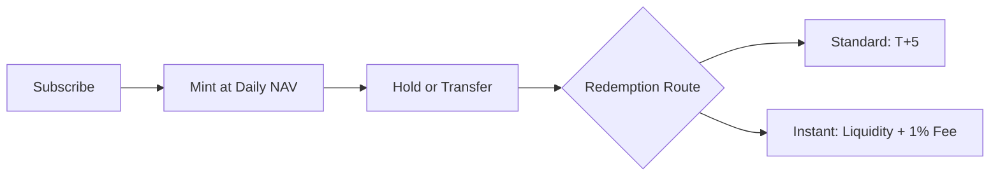

## Product Structure

### What GAIN Represents

GAIN is a transferable token representing a proportional economic interest in the net assets attributable to the GAIN product.

The indicative value of a holding is determined by the number of GAIN units held and the applicable NAV per unit:

$$
\text{Holding Value}_t
=
\text{GAIN Units Held}_t
\times
\text{NAV per GAIN}_t
$$

GAIN does not give a tokenholder direct ownership of any specific asset, trading position or exchange account. A tokenholder does not have a direct account relationship with, or a direct claim against, Binance, OKX, Bybit or Bitget solely by holding GAIN. Tokenholder rights are governed by the applicable product terms and offering documents.

### Issuer and Investment Manager

**Allocofi Limited**, a company incorporated in the British Virgin Islands, acts as the issuer and investment manager of GAIN. Its responsibilities include:

- issuing and redeeming GAIN;
- operating the underlying strategy;
- allocating assets across approved venues;
- maintaining product-level records;
- calculating and publishing NAV; and
- administering subscriptions and redemptions.

### Asset and Account Structure

Assets attributable to GAIN may be deployed through institutional accounts maintained with approved trading venues, including Binance, OKX, Bybit and Bitget.

GAIN assets are separately accounted for from Allocofi Limited’s operating funds and assets attributable to other products. Separate accounting identifies the assets, liabilities, income and expenses allocated to GAIN, but does not eliminate issuer, exchange, counterparty, custody or insolvency risk.

## Subscription Mechanics

### Applicable NAV

An accepted subscription uses the official NAV per GAIN published at **00:00 UTC** for the applicable calendar day. That NAV remains effective until the next daily NAV is published.

### Unit Calculation

No subscription fee is deducted. The number of GAIN units issued is:

$$
\text{GAIN Units Issued}
=
\frac{\text{Accepted Subscription Amount}}
{\text{Applicable NAV per GAIN}}
$$

#### Example

| Input | Value |
| :-- | --: |
| Accepted Subscription | 10,000 USDT |
| Applicable NAV | 1.25 USDT |
| Subscription Fee | 0% |
| **GAIN Issued** | **8,000 GAIN** |

$$
\frac{10{,}000}{1.25}
=
8{,}000\ \text{GAIN}
$$

### Minting and Settlement

Once a subscription is accepted, the corresponding GAIN units are minted and delivered to the connected wallet immediately. “Immediate” means the process is initiated without a scheduled waiting period, but actual completion remains dependent on blockchain confirmation, network conditions and operational checks.

<Note>
  The minimum subscription is 100 USDT or 100 USDC. GAIN does not charge a subscription fee, although blockchain network fees may apply.
</Note>

### Subscription Asset Record

The accepted subscription asset is recorded for redemption settlement:

| Subscription Asset | Redemption Settlement Asset |
| :-- | :-- |
| USDT | USDT |
| USDC | USDC |

If a subscription cannot be accepted after funds have been received, the funds are returned in accordance with the applicable product terms. Network costs or losses arising from an unsupported network, incorrect address or user error may not be recoverable.

## NAV & Pricing

### Valuation Standard

The official NAV per GAIN is denominated in **USDT** and published once daily at **00:00 UTC**. The initial NAV is:

$$
1\ \text{GAIN}
=
1.00\ \text{USDT}
$$

After launch, NAV may increase or decrease according to the net performance of the underlying strategy.

### Product NAV

The product NAV reflects the assets attributable to GAIN after accounting for liabilities, accrued expenses and applicable performance fees:

$$
\text{Product NAV}_t
=
\text{Gross Asset Value}_t
+ \text{Accrued Income}_t
- \text{Liabilities}_t
- \text{Accrued Fees}_t
$$

NAV per GAIN is calculated as:

$$
\text{NAV per GAIN}_t
=
\frac{\text{Product NAV}_t}
{\text{GAIN Units Outstanding}_t}
$$

The valuation may incorporate:

- stablecoin and cash balances;
- spot digital-asset positions;
- futures and perpetual-contract positions;
- realized and unrealized profit or loss;
- accrued funding income and expense;
- trading, exchange, borrowing and financing costs;
- product liabilities; and
- applicable performance fees.

### Transaction Pricing

| Transaction | Pricing Basis |
| :-- | :-- |
| Subscription | Official NAV published at 00:00 UTC for the applicable subscription day |
| Standard Redemption | Official NAV applicable on the date the request is submitted |
| Instant Redemption | Official NAV applicable to the accepted request |
| Wallet-to-Wallet Transfer | No NAV transaction occurs; the transfer moves existing GAIN units |
| Secondary-Market Trade | Price determined by the relevant market or counterparties |

### NAV and Secondary-Market Price

If GAIN trades through a secondary venue, its market price may differ from the official NAV:

$$
\text{Premium or Discount}
=
\frac{\text{Market Price}-\text{NAV per GAIN}}
{\text{NAV per GAIN}}
$$

<Warning>
  Official NAV is a valuation reference used for product transactions. It is not a guaranteed secondary-market bid, offer or execution price.
</Warning>

## Redemption Mechanics

<CardGroup cols={2}>
  <Card title="Standard Redemption" icon="calendar-days">
    Settlement target of T\+5 business days with no redemption fee.
  </Card>

  <Card title="Instant Redemption" icon="bolt">
    Immediate settlement with a 1% fee, subject to immediately available liquidity.
  </Card>
</CardGroup>

### Standard Redemption

Standard redemption proceeds are calculated using the official NAV applicable on the submission date:

$$
\text{Standard Redemption Proceeds}
=
\text{GAIN Units Redeemed}
\times
\text{Applicable NAV per GAIN}
$$

| Term | Standard Redemption |
| :-- | :-- |
| Settlement Target | T\+5 business days |
| Redemption Fee | 0% |
| Pricing Point | Applicable NAV on the submission date |
| Settlement Asset | Same stablecoin recorded for the corresponding subscription |
| Conditions | Daily redemption gate and operational requirements |

### Instant Redemption

Instant redemption uses available product liquidity and is subject to a fee equal to 1% of the gross redemption value:

$$
\text{Instant Redemption Proceeds}
=
\left(
\text{GAIN Units Redeemed}
\times
\text{Applicable NAV per GAIN}
\right)
\times
(1-1\%)
$$

| Term | Instant Redemption |
| :-- | :-- |
| Settlement Target | Immediate |
| Redemption Fee | 1% of gross redemption value |
| Pricing Point | Applicable NAV for the accepted request |
| Settlement Asset | Same stablecoin recorded for the corresponding subscription |
| Conditions | Daily redemption gate and immediately available liquidity |

#### Comparison Example

For GAIN with a gross redemption value of 10,000 USDT:

| Method | Gross Value | Fee | Estimated Proceeds |
| :-- | --: | --: | --: |
| Standard | 10,000 USDT | 0 USDT | 10,000 USDT |
| Instant | 10,000 USDT | 100 USDT | 9,900 USDT |

### Daily Redemption Gate

Standard and instant redemptions share a product-level daily gate. The total redemption value processed during a UTC calendar day may not exceed **30% of the previous day’s Final AUM**:

$$
\text{Daily Redemption Capacity}_t
=
30\%
\times
\text{Previous Day Final AUM}_{t-1}
$$

Requests that exceed the remaining daily capacity enter a first-in, first-out queue and are processed on subsequent UTC days, subject to the capacity then available.

<Accordion title="Daily gate example">
  If the previous day’s Final AUM was 10,000,000 USDT, the current day’s aggregate redemption capacity would be:

  $$
  30\%
\times
10{,}000{,}000
=
3{,}000{,}000\ \text{USDT}
  $$

  Standard and instant redemptions count toward the same 3,000,000 USDT daily limit.
</Accordion>

### Insufficient Instant Liquidity

If sufficient liquidity is not immediately available:

1. the instant-redemption request is not automatically converted;
2. the user may choose to submit a standard-redemption request; and
3. the standard request is processed according to the daily gate and its position in the queue.

<Warning>
  T\+5 and immediate settlement are processing targets, not unconditional guarantees. Settlement may be delayed by the daily gate, market disruption, exchange restrictions, blockchain congestion, security incidents, legal requirements or other exceptional circumstances described in the product terms.
</Warning>

## Fees & Expenses

| Fee or Cost | Treatment |
| :-- | :-- |
| Subscription Fee | 0% |
| Standard Redemption Fee | 0% |
| Instant Redemption Fee | 1% of gross redemption value |
| Management Fee | 0% |
| Performance Fee | Reflected in the published NAV |
| Other Product-Level Expenses | None currently charged |
| Blockchain Network Fees | Paid separately by the user when applicable |

### Performance Fee Treatment

Any applicable performance fee is incorporated into the NAV calculation before the official NAV is published. It is not collected as a separate payment when a user subscribes, holds, transfers or redeems GAIN.

### Operating Costs Reflected in NAV

Trading fees, funding costs, borrowing costs and similar expenses incurred by the strategy are reflected in strategy performance and therefore in NAV. They are not charged as separate user-facing product fees.

<Info>
  Blockchain gas fees are network costs rather than GAIN product fees. They may apply to token approvals, subscriptions, transfers and redemption requests.
</Info>

## GAIN Token Mechanics

### Token Function

GAIN records the number of valid product units held by each onchain address. Supply changes only through accepted subscriptions and redemptions.

| Mechanic | Treatment |
| :-- | :-- |
| Minting | New units are created following an accepted subscription |
| Burning | Redeemed units are removed through the official redemption process |
| Transferability | GAIN may be transferred between compatible addresses |
| Live Networks | Ethereum and BNB Chain |
| Opening Soon | Solana |
| Supply Principle | Onchain supply should correspond to valid GAIN units outstanding |

### Supply Changes

When a subscription is accepted:

$$
\text{New Supply}
=
\text{Existing Supply}
+ \text{GAIN Units Minted}
$$

When a redemption is completed:

$$
\text{New Supply}
=
\text{Existing Supply}
- \text{GAIN Units Burned}
$$

### Transfers

A transfer moves existing GAIN units between compatible addresses. It does not create a subscription, trigger a redemption or change the product’s NAV.

Users are responsible for confirming that:

- the recipient address and selected network are correct;
- the receiving wallet or smart contract supports GAIN;
- the transfer complies with applicable laws and product restrictions; and
- sufficient native network tokens are available to pay gas fees.

<Warning>
  Blockchain transfers are generally irreversible. GAIN sent to an incorrect address, unsupported network or incompatible smart contract may be permanently inaccessible.
</Warning>

## Mechanics Summary

<Info>
  These mechanics are subject to the definitive product terms, offering documents, NAV methodology and risk disclosures. If any inconsistency arises, the definitive documents prevail.
</Info>